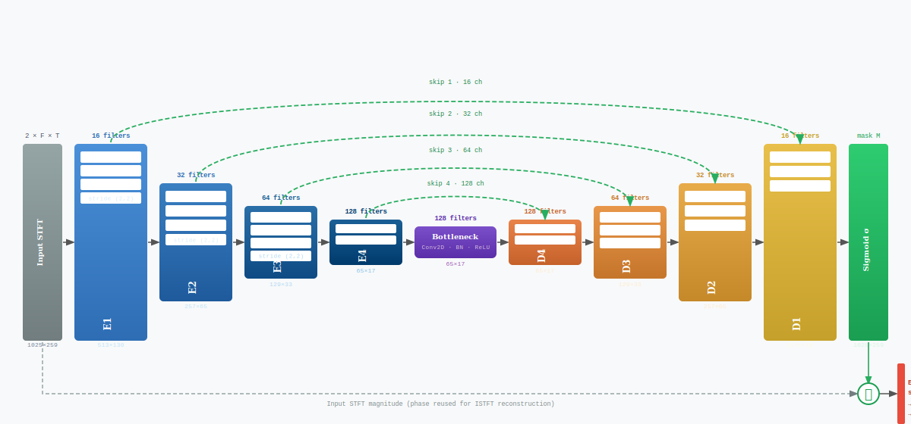

# Mini U-Net — Audio Source Separation

Architecture encoder-decoder (U-Net) pour la séparation de sources audio,
inspirée de **Spleeter** (Deezer Research) et réimplémentée en **PyTorch**.

Entraîné sur **MUSDB18** (subset réduit pour faisabilité CPU/GPU modeste).

---

## Architecture



**Nombre de paramètres par source :** ~450K (vs 17M pour Spleeter complet)

---

## Installation

```bash
pip install -r requirements.txt
```

---

## Entraînement

```bash
# Entraîner sur vocals (recommandé en premier)
python train.py \
    --musdb_root /path/to/musdb18 \
    --source vocals \
    --train_tracks 25 \
    --val_tracks 5 \
    --epochs 20 \
    --batch_size 8 \
    --loss l1

# Entraîner toutes les sources
for source in vocals drums bass other; do
    python train.py --musdb_root /path/to/musdb18 --source $source
done
```

Les checkpoints sont sauvegardés dans `./outputs/best_model_{source}.pt`.
Les courbes de loss sont dans `./outputs/loss_curves_{source}.png`.

---

## Évaluation (métriques BSS-Eval)

```bash
python evaluate.py \
    --musdb_root /path/to/musdb18 \
    --model_path outputs/best_model_vocals.pt \
    --source vocals \
    --n_tracks 5
```

Résultats attendus (ordre de grandeur après 20 époques, 25 pistes train) :

| Système       | SDR (dB) | 
|---------------|----------| 
| Baseline naïf | -5.39     |  
| **Notre modèle** | **1.95**  | 
| UMX (référence) | 6.32   | 

> L'objectif n'est pas de battre UMX mais de **montrer que le modèle apprend**
> (SDR > baseline naïf, loss qui descend).

---

## Démo Streamlit

```bash
streamlit run app.py
```

Puis ouvrir `http://localhost:8501` dans le navigateur.

---

## Structure du projet

```
demix_project/
├── models/
│   └── unet.py          # Architecture U-Net PyTorch
├── data/
│   └── dataset.py       # DataLoader MUSDB18
├── train.py             # Script d'entraînement
├── evaluate.py          # Évaluation BSS-Eval
├── app.py               # Application Streamlit
├── requirements.txt
└── README.md
```

---

## Références

- Jansson et al., *Singing Voice Separation with Deep U-Net Convolutional Networks*, ISMIR 2017
- Hennequin et al., *Spleeter: a fast and efficient music source separation tool*, JOSS 2020
- Stöter et al., *Open-Unmix – A Reference Implementation for Music Source Separation*, JOSS 2019
- Défossez et al., *Hybrid Transformers for Music Source Separation*, ICASSP 2023
